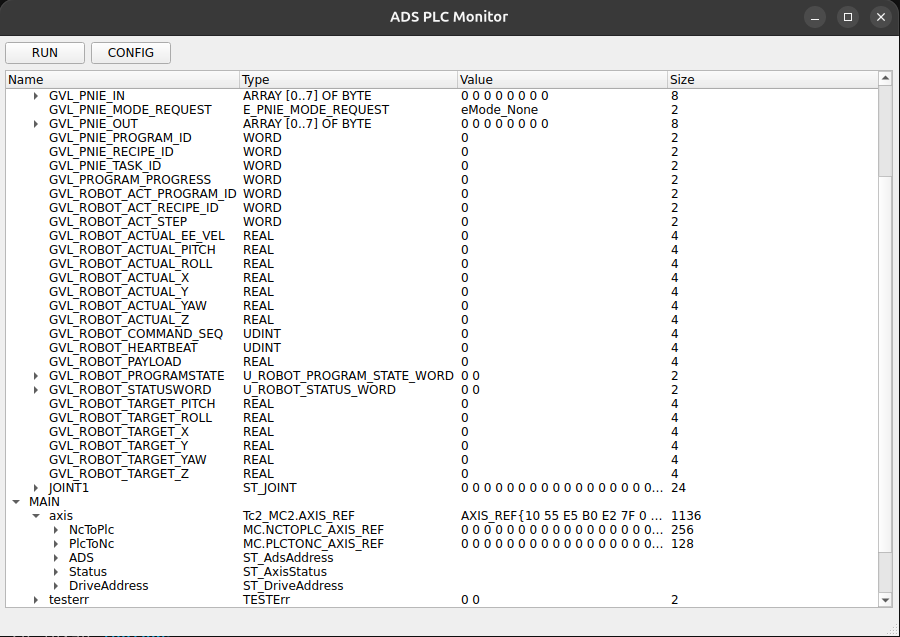
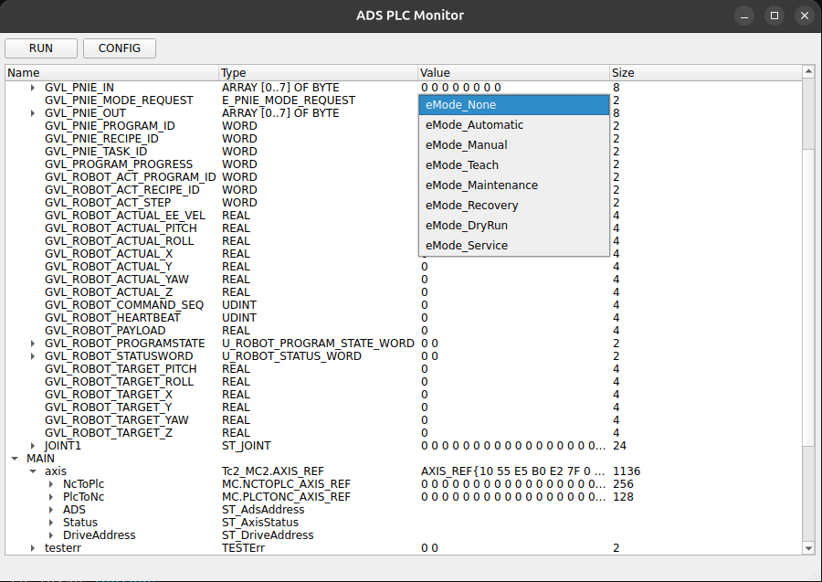
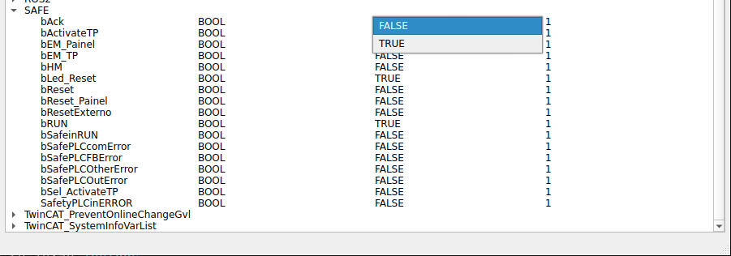
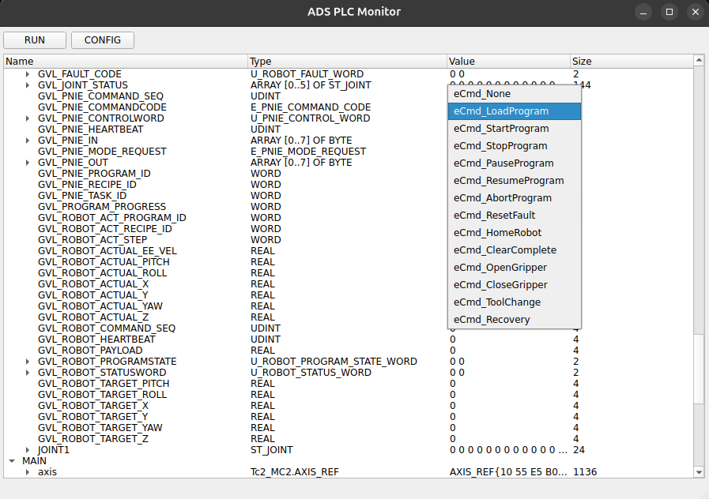
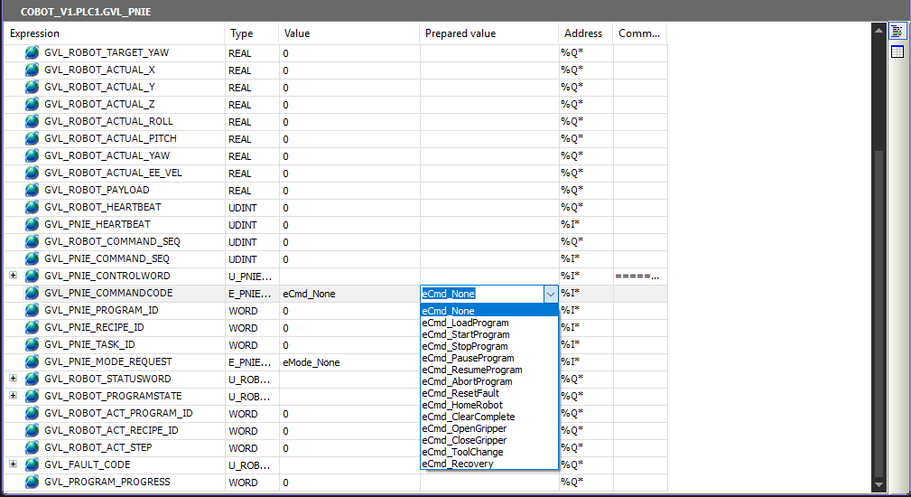
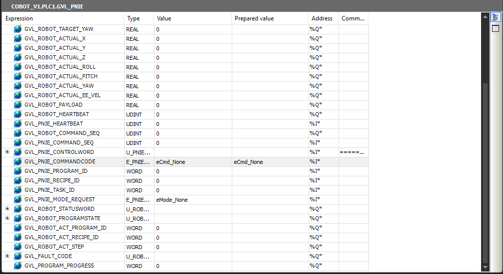
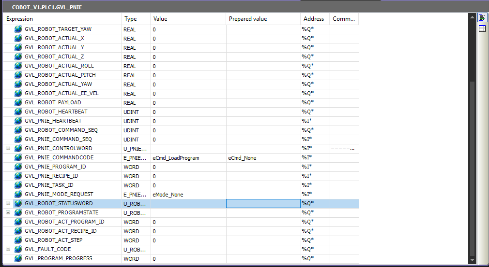

# ADS Qt Monitor

A lightweight Qt desktop application for **monitoring and editing Beckhoff TwinCAT
PLC variables live** over ADS. It connects to a running PLC, reads its symbol and
type tables directly from the controller, and presents every variable — including
nested structs, unions, arrays, enums and individual bits — in an editable tree
that updates in real time.

## Screenshots

### Live variable tree

Variables are grouped by program / global list (here `GVL_PNIE` and `MAIN`), with
structs, arrays, enums and axis references expanded inline. Names are shown without
the group prefix, and values refresh in real time.



### Editing — dropdowns for enums, BOOL and BIT

Enum, BOOL and BIT values are edited from a dropdown of their valid states, written
straight to the PLC on selection.

| Enum states | BOOL |
|---|---|
|  |  |

The dropdown options are read from the PLC's own type definitions, so they always
match the controller's enumerator list exactly:

| In the monitor | In TwinCAT |
|---|---|
|  |  |

### Changes land in the PLC

A value changed in the monitor is written to the controller immediately. Here
`GVL_PNIE.CommandCode` goes from `eCmd_None` to `eCmd_LoadProgram` in the monitor,
and the new value shows up live in the TwinCAT watch view.

**1. Before** — TwinCAT shows `eCmd_None`:



**2. Change in the monitor** — pick `eCmd_LoadProgram` from the dropdown:


**3. After** — TwinCAT now reads `eCmd_LoadProgram`:



## How it works

When the app starts it:

1. **Connects** to the PLC over ADS (adds an AMS route and opens a port).
2. **Uploads the symbol list** from the controller — every global/program variable
   and its address, type and size.
3. **Uploads the type definitions** (`SYM_DT_UPLOAD`) so it knows the internal
   layout of every struct, union, enum and alias used by the project. This is read
   straight from the compiled PLC — there is nothing to configure or import.
4. **Builds the variable tree**, grouping entries by their first path segment
   (`MAIN.Axis` → group **MAIN**, `SAFE.bReset` → group **SAFE**, …) and expanding
   structs/unions/arrays down to their individual members and bits.
5. **Polls** all values in a single batched ADS read a few times per second and
   refreshes the visible rows.

Editing a value writes it straight back to the PLC:

- plain numbers/strings are typed in,
- **enums**, **BOOL** and **BIT** values are picked from a **dropdown** of their
  valid states,
- unions overlay their members correctly (e.g. a control word and its individual
  bits map to the same bytes).

The **RUN / CONFIG** buttons switch the PLC runtime state; the app automatically
reconnects after a state change.

## Requirements

- Linux (or Windows) with a working **TwinCAT ADS router** / connection to the PLC
- **Qt 6** (Widgets)
- **CMake ≥ 3.16** and a C++17 compiler
- Git (the Beckhoff ADS library is included as a submodule)

## Build & run

```bash
# 1. Clone with the ADS submodule
git clone <repo-url>
cd qt-ads
git submodule update --init --recursive

# 2. Build
cmake -S . -B build
cmake --build build

# 3. Run
./build/ads_qt_monitor
```

> Running over SSH? Use `ssh -Y` so the GUI is forwarded to your machine, and make
> sure `DISPLAY` points at the forwarded display (e.g. `localhost:10.0`), not the
> server's local screen (`:0`).

## Configuration

The target PLC is set in `src/plc_monitor_window.cpp` (there is no settings UI yet):

```cpp
netid_{127, 0, 0, 1, 1, 1},   // AMS NetId of the PLC
ip_("127.0.0.1"),             // IP address
ams_port_(851),               // ADS port (851 = first PLC runtime)
```

Edit these to point at your controller and rebuild.

## Using the monitor

- **Browse**: expand a group, then a variable, to drill into struct/union/array
  members and bits. Values refresh automatically.
- **Edit**: double-click a value. Numbers/strings open a text field; enum/BOOL/BIT
  open a dropdown. The change is written to the PLC immediately.
- **Runtime state**: use **RUN** / **CONFIG** to change the PLC mode.

## Project layout

```
src/                 Application source (UI, ADS client, type parsing)
include/ADS/         Beckhoff ADS library (Git submodule)
include/twincat_ads/ TwinCAT ADS headers + platform library
CMakeLists.txt
```

The CMake option `USE_TWINCAT_ROUTER` (ON by default) builds the app against a
locally installed TwinCAT router; turning it OFF uses the submodule's standalone
TCP/IP ADS backend.
